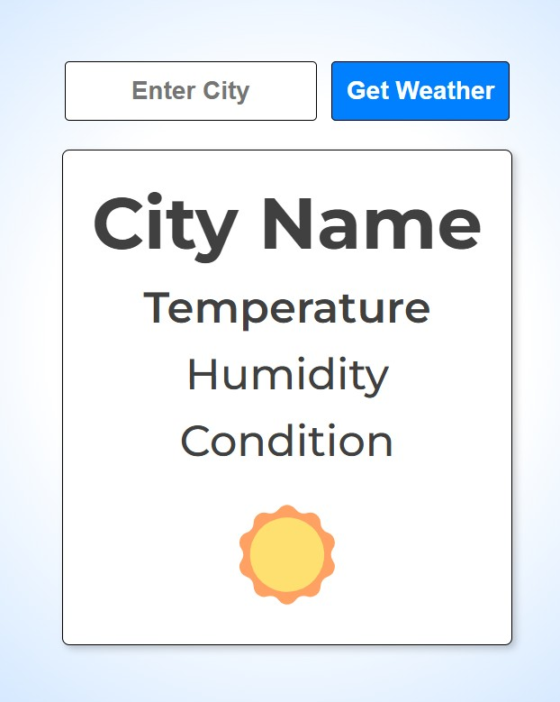
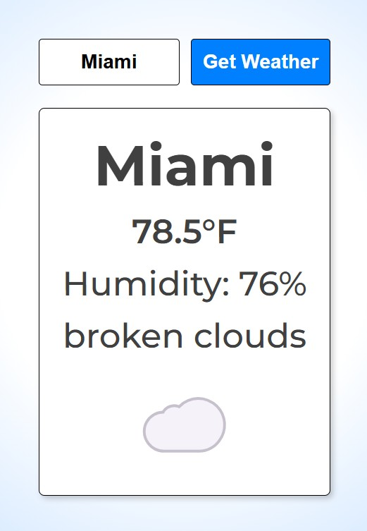

# Weather Widget

## Project Summary

Weather Widget is a full-stack web application that allows users to search for real-time weather data by city. Built with HTML, CSS, and JavaScript on the frontend and Node.js/Express on the backend, it securely integrates with the OpenWeather API through an environment-protected proxy server.

The application features a clean, mobile-friendly interface that delivers accurate weather information including temperature, humidity, and conditions. The backend architecture demonstrates secure API key management using .env variables, preventing exposure in client-side code while maintaining seamless frontend functionality.

This project showcases modern web development practices including REST API consumption, DOM manipulation, responsive design, and secure server-side API key handling. Users can input any city name and instantly receive weather data through the protected backend endpoint, which processes requests while keeping sensitive credentials secure.

## Table of Contents

- [Mock-Up](#mock-up)
- [Instructions](#instructions)
- [Key Features](#key-features)
- [Deployed Aplication](#deployed-application)

## Mock-Up

The following image shows the web application's appearance and functionality:

## Instructions

To use this application, follow these simple steps:

- Download the project files or clone the repository.

- Open `index.html` in your preferred browser.

- Type a city name into the search bar and hit "Search".

- View current weather data and 5-day forecast below.

## Key Features

**Responsive Layout:** Clean, mobile-friendly UI that adapts to any screen size.

**City Search Functionality:** Instantly fetches weather data based on city name input.

**Forecast Cards:** Displays weather icons, temperature, humidity, and wind for upcoming days.

**Modern Styling:** Custom styling using Flexbox, consistent spacing, and clear visual hierarchy.

**Middle-Centered Layout:** Ensures the search and display elements remain vertically centered on screen.

**Real-Time API Integration:** Retrieves live weather data and 5-day forecasts from the OpenWeather API.

## Deployed Application

[Weather App](https://weather-app-tqap.onrender.com)